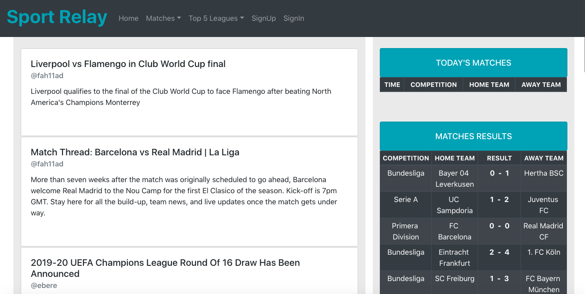
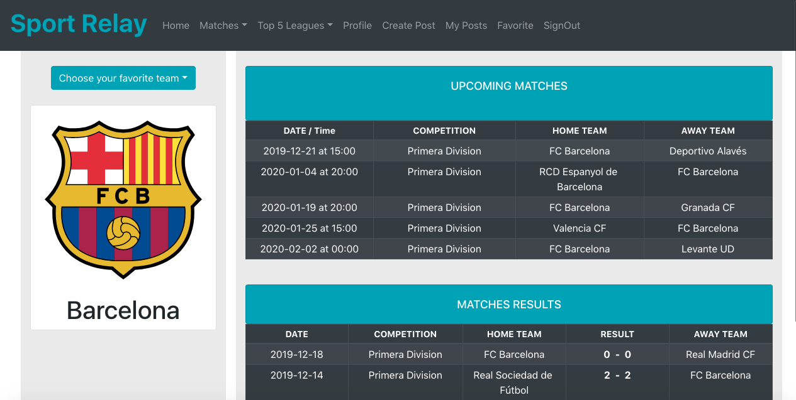

### Project Title

### Sport Relay

### Description

Sport Relay is a web application provides two main features, first one: allows user to see football news, such as scheduled matches, results of matches and Standings Tables of top five leagues. In addition, the user can choose his favorite team and see all related results and upcoming matches.
second one: allows a user to communicate with others throw creating or watching posts and adding comment to these posts.


### Technologies and libraries

```
Frontend:
react
jwt-decode
axios
react-bootstrap
sweetalert


Backend:
express
mongoose
bcrypt/bcryptjs
cors
jsonwebtoken
passport
dovtenv
```

### Wireframes

#### Main pages





### User stories

- As a user I would like to see all football matches details.
- As a user I would like to see all football results details.
- As a user I would like to see all posts.
- As a user I would like to create posts.
- As a user I would like to delete posts.
- As a user I would like to add comment to the post.
- As a user I would like to register and login.
- As a user I would like to choose my favorite team and see all related details.


### Planning and development process

- ##### pre-project week work

  1. Brainstormed the main features of the website.
  2. Designed the website wireframes.
  3. Splitting the tasks.

- ##### project week work (members work)

  - Mohammed
    - Backend ( User and Post routes)
    - Linking of the backend with the frontend
    - Post functionalty
    - authintaction
  - Fahad
    - Frontend
    - Favorite functionalty
    - Styling
    - API functionalty
  

### Problem-solving strategy

Console.log() and inspect from the web browser

### Future Planning

we will add admin feature the the app


### Acknowledgment 

We are grateful for our instructors and our classmates for their help and support.

### References

 * API Source: https://www.football-data.org/
 * React Bootstrap: https://react-bootstrap.github.io/

  
  
  
  
  
  
  
